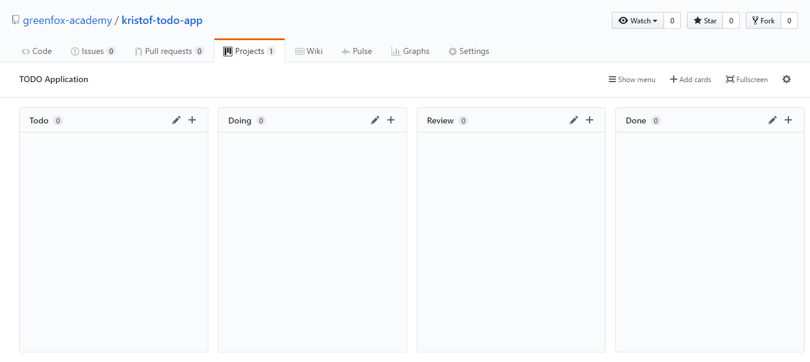

# Projekt: TODO Applikáció

Írj egy parancssori alkalmazást, hogy könnyedén követni tudd napi teendőidet!\
Ez egy **összetett feladat**, így kérlek először olvasd végig figyelmesen a
feladatleírást, és csak utána kezdj el dolgozni.

## Tananyagok & Források

| Tananyag     |
| :----------- |
| [Gherkin nyelv](https://hu.wikipedia.org/wiki/Viselked%C3%A9svez%C3%A9relt_fejleszt%C3%A9s#Viselked%C3%A9si_el%C5%91%C3%ADr%C3%A1sok) (csak a "Viselkedési előírások" szekció) |

## Tananyag áttekintés

- Mi az a Gherkin nyelv?
- `Given`, `When`, `Then`, `And` kulcsszavak jelentése
- Mik azok a command line (parancssori) argumentumok?

## Feladatok

### Alapvető funkcionalitás (feature-ök) (kötelező)

<!-- a linkek(fragmentek) nem mukodnek ekezetesen -->

- [Használat megjelenítése](#hasznalat-megjelenitese)
- [Tennivalók kilistázása](#tennivalok-kilistazasa)
  - Egy tennivalónak legalább két tulajdonsága van:
    - feladatleírás
    - állapot, mely mutatja, hogy el van-e végezve (státusz)
- [Üres lista](#ures-lista)
- [Új tennivaló hozzáadása](#uj-tennivalo-hozzaadasa)
- [Tennivaló elvégzése](#tennivalo-elvegzese)
- [Tennivaló eltávolítása](#tennivalo-eltavolitasa)
- [Argumentum hibakezeles](#argumentum-hibakezeles)

### Haladó (opcionális)

- [Új tennivaló hozzáadása - hibakezelés](#uj-tennivalo-hozzaadasa---hibakezeles)
- [Tennivaló eltávolítása - hibakezelés](#tennivalo-eltavolitasa---hibakezeles)
- [Tennivaló elvégzése - hibakezelés](#tennivalo-elvegzese---hibakezeles)
- Írj unit teszteket minden olyan egységre, ahol szükségét érzed!
- Refaktoráld az applikációt, hogy megegyezzen az ajánlott architektúrával!
- Bármi egyéb, ami az eszedbe jut, pl:
  - hosszabb, beszédes parancsok
  - listázd a nem elvégzett feladatokat az `-l` argumentummal, az összeset pedig
    az `-la`-val
  - adj hozzá/ távolíts el/ pipálj ki több feladatot egy paranccsal
  - rendezkedj be több felhasználóra

## Story-k

A user story-k rövid “történetek”, amiket a megrendelők, felhasználók
szeretnének viszontlátni a termékben. Bővebben [itt tudsz utánaolvasni.](https://promanconsulting.hu/agilis-projekt/#agilis7)
(A továbbiakban: "story" / "user story". Magyarul mint "felhasználói történet"
olvasható néhány helyen, ez azonban nem eléggé beszédes, így maradnánk az angol
"hivatalos "verziónál.)

Ahhoz, hogy követni tudjuk az applikációnk állapotát, és adminisztrálni,
managelni tudjuk a munkafolyamatot, úgynevezett Kanban Board-okat használunk.
Ezek a board-ok tartalmazzák a user story-kat, külön oszlopokba rendszerezve.
Az oszlopok a tennivalók állapotát/státuszát jelzik: Todo ("tennivaló"),
doing ("már dolgozom rajta"), review ("átnézés alatt"), done ("kész").

Készítsd el a Kanban Board-odat, és vidd fel a Todo applikáció user story-jait.
A fejlesztés során folyamatosan frissítsd a feladataid állapotát, hogy lásd, mi
hol tart, és tudd, mik a következő lépések

### Hogyan hozd létre a Kanban Board-odat, és hol dolgozz?

- Hozz létre egy új publikus repository-t a [green-fox-academy](https://github.com/green-fox-academy/)
  organizáción belül
- A repo-t így nevezd el: `github_felhasznaloneved_todo_app`, behelyettesítve
  természetesen a felhasználóneveddel
- Ebben a repo-ban fogod fejleszteni az applikációdat. Más szavakkal, ide fogod
  felpusholni a kódodat.
- **Ne felejtsd el hozzáadni `.gitignore` fájlt!**
- Adj hozzá egy tag-et a repository-dhoz az osztályod nevével
- Az új repository-dban a Projects menüpontban hozz létre egy projectet
  *TODO Applikáció* névvel
- Az alábbi oszlopokat tartalmazza:
  - Todo
  - Doing
  - Review
  - Done
- Ha szeretnéd, a fentebb felsorolt magyar megfelelőikkel is helyettesítheted,
  a lényeg, hogy te átlásd a folyamatot, hogy mikor milyen státuszban vannak a
  teendőid
- Add hozzá a story-kat a board-hoz

Valahogy így kéne kinéznie: (persze a tiéden már szerepelnie kell majd a
feladatoknak)



Ne legyen 2-nél több story a "Doing" fázisban.\
Hogyha már van néhány story a "Review" státuszban, mutasd meg őket egy
mentornak.

### Hasznalat megjelenitese

- **Adott** a megnyitott terminál a projekt könyvtáron belül
- **Amikor** elindítom az alkalmazást argumentum nélkül
- **Akkor** ki kell nyomtatnia az applikáció "használati utasítását"

```text
$ todo

Parancssori Todo applikáció
=============================

Parancssori argumentumok:
    -l   Kilistázza a feladatokat
    -a   Új feladatot ad hozzá
    -r   Eltávolít egy feladatot
    -c   Teljesít egy feladatot
```

### Tennivalok kilistazasa

- **Adott** a megnyitott terminál a projekt könyvtáron belül
- És a fájl, ahol tároljuk a tennivalókat
- Adj hozzá egy tennivalót a fájlhoz ezzel a leírással: `Kutyát sétáltatni`
- Adj hozzá egy tennivalót a fájlhoz ezzel a leírással: `Tejet venni`
- Adj hozzá egy tennivalót a fájlhoz ezzel a leírással: `Megcsinálni a leckét`
- **Amikor** az applikációt az `-l` argumentummal futtatjuk
- **Akkor** nyomtassa ki a konzolra a tennivalókat a fájlból, ahol tároljuk
  őket
- És adjon eléjük sorszámot

```text
$ todo -l

1 - Kutyát sétáltatni
2 - Tejet venni
3 - Megcsinálni a leckét
```

### Ures lista

- **Adott** a megnyitott terminál a projekt könyvtáron belül
- És a fájl, ahol tároljuk a tennivalókat
- És a fájlban 0 tennivaló van elmentve
- **Amikor** az applikációt az `-l` argumentummal futtatjuk
- **Akkor** nyomtassa ki a konzolra az alábbi üzenetet:\
  `Nincs mára tennivalód! :)`

### Uj tennivalo hozzaadasa

- **Adott** a megnyitott terminál a projekt könyvtáron belül
- **Amikor** az applikációt az `-a "Megetetni a papagájt"` argumentummal
  futtatjuk
- **Akkor** az app adja hozzá a listánkhoz az új tennivalót
  *Megetetni a papagájt* leírással

### Uj tennivalo hozzaadasa - hibakezeles

- **Adott** a megnyitott terminál a projekt könyvtáron belül
- **Amikor** az applikációt az `-a` argumentummal futtatjuk
- **Akkor** nyomtassa ki a konzolra az alábbi üzenetet:\
  `Nem lehetséges új feladat hozzáadása: nincs megadva a feladat!`

### Tennivalo eltavolitasa

- **Adott** a megnyitott terminál a projekt könyvtáron belül
- És a fájl, ahol tároljuk a tennivalókat
- És a fájlban 0 tennivaló van elmentve
- **Amikor** az applikációt az `-r 2` argumentummal futtatjuk
- **Akkor** az app távolítsa el a második tennivalónkat a fájlból

### Tennivalo eltavolitasa - hibakezeles

- `1.`

  - **Adott** a megnyitott terminál a projekt könyvtáron belül
  - **Amikor** az applikációt az `-r` argumentummal futtatjuk
  - **Akkor** nyomtassa ki a konzolra az alábbi üzenetet:\
    `Nem lehetséges az eltávolítás: nem adott meg indexet!`

- `2.`

  - **Adott** a megnyitott terminál a projekt könyvtáron belül
  - És a fájl, ahol tároljuk a tennivalókat
  - És a fájlban 0 tennivaló van elmentve
  - **Amikor** az applikációt az `-r 20` argumentummal futtatjuk
  - **Akkor** nyomtassa ki a konzolra az alábbi üzenetet:\
    `Nem lehetséges az eltávolítás: túlindexelési probléma adódott!`

  (*Túlindexelés: Ha a futás során egy index nincs benne a tömb megengedett
  indexeinek tartományában, angolul "index out of bound"*)

- `3.`

  - **Adott** a megnyitott terminál a projekt könyvtáron belül
  - **Amikor** az applikációt az `-r apple` argumentummal futtatjuk
  - **Akkor** nyomtassa ki a konzolra az alábbi üzenetet:\
    `Nem lehetséges az eltávolítás: a megadott index nem szám!`

### Argumentum hibakezeles

- **Adott** a megnyitott terminál a projekt könyvtáron belül
- **Amikor** az applikációt egy nem támogatott argumentummal futtatjuk
  *(pl. `get`)*
- **Akkor** nyomtassa ki a konzolra az alábbi üzenetet:\
  `Nem támogatott argumentum!`
- És nyomtassa ki az applikáció "használati utasítását"

### Tennivalo elvegzese

- **Adott** a megnyitott terminál a projekt könyvtáron belül
- És a fájl, ahol tároljuk a tennivalókat
- És a fájlban 0 tennivaló van elmentve
- **Amikor** az applikációt az `-c 2` argumentummal futtatjuk
- **Akkor** az alkalmazás állítsa át a második tennivaló státuszát elvégzettre

### Minden feladat kinyomtatása státusszal

- **Adott** a megnyitott terminál a projekt könyvtáron belül
- És egy nem elvégzett feladat: `Kutyát sétáltatni`
- És egy elvégzett feladat: `Tejet venni`
- És egy nem elvégzett feladat: `Megcsinálni a leckét` a fájlban
- **Amikor** az applikációt az `-l` argumentummal futtatjuk
- **Akkor** nyomtassa ki a konzolra a feladatokat a fájlból
- És adja hozzá a sor elejéhez ezt:
  - `[ ]`, ha a tennivaló nincs elvégezve,
  - `[x]`, ha a tennivaló el van végezve

```text
1 - [ ] Kutyát sétáltatni
2 - [x] Tejet venni
3 - [ ] Megcsinálni a leckét
```

### Tennivalo elvegzese - hibakezeles

#### Hiányzó index

- **Adott** a megnyitott terminál a projekt könyvtáron belül
- **Amikor** az applikációt az `-c` argumentummal futtatjuk
- **Akkor** nyomtassa ki a konzolra az alábbi üzenetet:\
  `Nem lehetséges a feladat végrehajtása: nem adtál meg indexet!`

#### Nem létező index

- **Adott** a megnyitott terminál a projekt könyvtáron belül
- És a fájl, ahol tároljuk a tennivalókat
- És a fájlban 0 tennivaló van elmentve
- **Amikor** az applikációt az `-c 20` argumentummal futtatjuk
- **Akkor** nyomtassa ki a konzolra az alábbi üzenetet:\
  `Nem lehetséges a feladat végrehajtása: túlindexelési probléma adódott!`

### Invalid argumentum típus

- **Adott** a megnyitott terminál a projekt könyvtáron belül
- **Amikor** az applikációt az `-c apple` argumentummal futtatjuk
- **Akkor** nyomtassa ki a konzolra az alábbi üzenetet:\
  `Nem lehetséges a feladat végrehajtása: a megadott index nem szám`