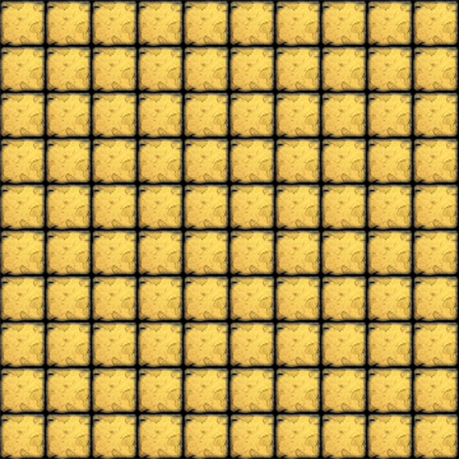
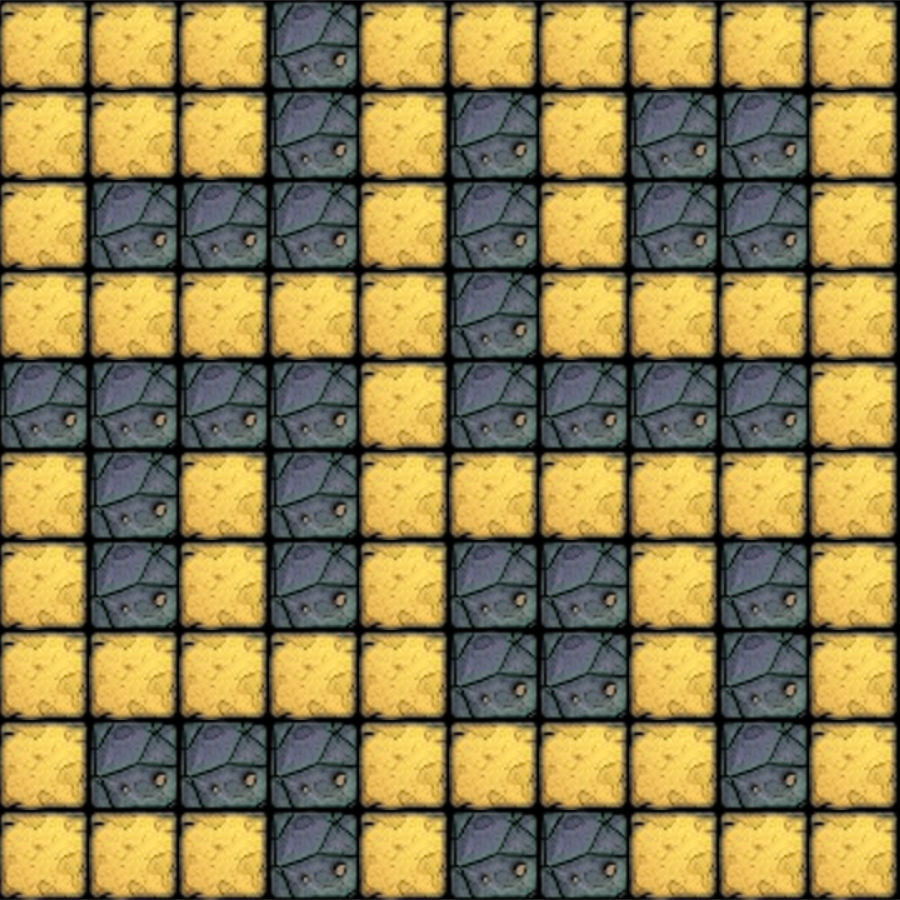
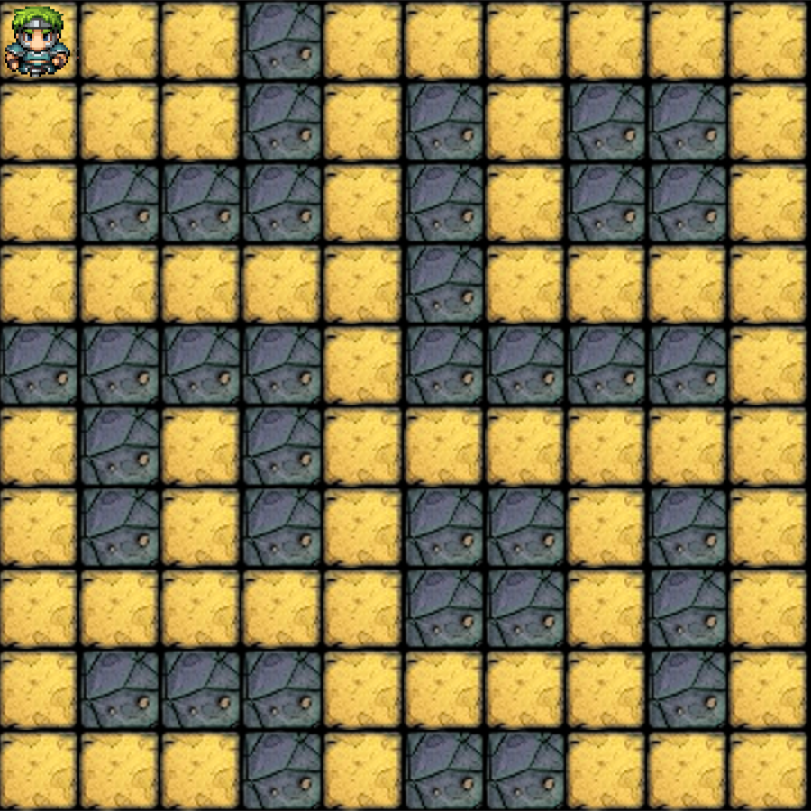

# Bevezetés

*A sztorikon megvalósítással menjünk végig. Egy sztori elkészítése azt
jelenti, hogy megvalósítottad a projekt egy kis szeletét.*

*Tartsd észben, hogy az egész játékot le kell fejlesztened. Szóval mikor
egy specifikus sztorin dolgozol úgy alakítsd ki, hogy később ezeket újra
tudd használni az előrehaladás során.*

## Rajzolj ki egy képernyőt mezőkkel

### 1. Rajzolj ki egy mezőt

- Elindítjuk a játékot
- Ilyen mezőt (tile) kell látnod:

| Floor tile                  |
| --------------------------- |
|  |

### 2. Töltsd fel a képernyőt mezőkkel

- Elindítjuk a játékot
- Egy ilyen pályát kell látnod mezőkkel:

### 3. Adj hozzá fal (wall) mezőket

- Elindítjuk a játékot
- Mikor a pálya kirajzolódik
- Akkor a képernyőn floor és wall mezőket kell látnunk, mint a képen
  (másképpen is elrendezheted őket ha akarod):

| Floor tile                          | Wall tile                       |
| :---------------------------------: | :-----------------------------: |
|          |        |

## Helyezz el egy karaktert a pályán és mozgasd a gombokkal

### 4. Helyezd el a Hőst (hero)

- Elindítjuk a játékot
- Mikor a pálya kirajzolódik
- Hozzáad egy játékos karaktert amit hero-nak hívnak
- A hero-nak a bal felső sarokba kell kirajzolódnia:

| Hero                       |
| -------------------------- |
|  |

## Interakciók

A játékosnak képesnek kell lennie a hero mozgatására a billentyűzet nyilaival.

### 5. Körbejárás

- Elindítjuk a játékot
- Mikor *bármelyik* nyíl billentyűt megnyomja a játékos
- A hero-nak abba az irányba kell elmozdulnia

### 6. Hero irány

- Elindítjuk a játékot
- Mikor a hero-t elmozdítjuk a nyilakkal
- Akkor a hero abba az irányba kell néznie amerre ment

| Hero Up                | Hero Right                   | Hero Down                  | Hero Left                  |
| ---------------------- | ---------------------------- | -------------------------- | -------------------------- |
|  |  |  |  |

### 7. Pálya határok

- Adott a hős a pálya szélén
- Mikor a herot a nyilakkal a pálya széle felé mozdítjuk
- Ne hagyja el a pályát, csak a hős irányát változtassa meg ha szükséges

### 8. Falak

- Adott a hős egy wall mező mellett.
- Amikor a hero-t a nyilakkal a wall mező irányába mozgatjuk
- Akkor ne mozduljon, csak az iránya változzon ha szükséges

## Kibővítés más karakterekkel

### 9. Csontvázak (skeletons)

- Elindítjuk a játékot
- Amikor a pálya betölt a képernyőre
- Akkor 3 skeleton-t kell látnunk a képernyőn, valahol a floor mezőkön
  elhelyezve

| Skeleton                          |
| --------------------------------- |
|  |

### 10. Boss

- Elindítjuk a játékot
- Amikor a pálya betölt a képernyőre
- A boss legyen a pályán, valahol egy floor mezőn

| Boss                      |
| ------------------------- |
|  |

## Készítsd el az infópanel, harc és a játék logikáit

### 11. Értékek (stats)

- Elindítjuk a játékot
- Amikor a pálya betölt a képernyőre
- Akkor a stat-oknak a pálya alatt meg kell jelennie, egy fehér téglalapban
  fekete betűkkel.
  - Az alábbiakat tartalmazza:
    - A Hero szintje
    - A Hero aktuális HP-ja (*életpont*)
    - A Hero max HP-ja
    - A Hero DP-je (*védekező pontja*)
    - A Hero SP-je (*sebzés pontja*)
  - Mint itt: `Hero (Level 1) HP: 8/10 | DP: 8 | SP: 6`

### 12. Támadás

- A karakterek képesek támadni, részletek a [specifikációban](wanderer.hu.md#támadás)

### 13. Harci logika

- Miután a hero karakter támadott a védekező karakternek vissza kell támadnia

### 14. Következő szint

- Mikor az ellenség akinél a kulcs van meghal, és a boss is halott a hero
  automatikusan egy magasabb szintű pályára kerül.

## Opcionális jellemzők (features)

### 15. Karakterek frissítése mikor a hero mozog

- A karakterek csak akkor mozogjanak, ha a játékos mozgatja a hőst a
  billentyűk segítségével.

### 16. Véletlen pálya

- Mikor a pálya készül, a wall-ok elhelyezése legyen véletlen
- Győződj meg róla, hogy az összes floor mező kapcsolódik egymáshoz

### 17. Balanszolás és események

- Adj több HP-t / SP-t a hero-nak a specifikáció alapján
- Adj több HP-t / SP-t a szörnyeknek
- Készíts véletlen eseményeket, amik az új pályára lépés során történnek

### 18. Mászkáló szörnyek

- A szörnyek mászkáljanak a pályán, a hero-tól függetlenül
- A szörnyek mozgása gyorsuljon a pályák szintjétől függően